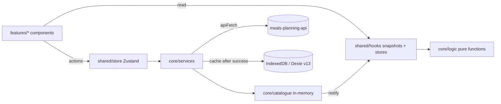

# Architecture

How the code is organised today (verified against `src/` on 2026-10-07). Rules that constrain new code are summarised in `AGENTS.md`; coding style lives in `docs/conventions.md`; screen behaviour in `docs/spec-*.md`; API contracts in `docs/api.md`.

## Overview

Artemis Foodlab is a React PWA served from GitHub Pages. It consumes `meals-planning-api` (separate repo: Express + PostgreSQL + Prisma, hosted on Render + Supabase), which is the **source of truth** for the catalogue (recipes, foods, outdoor activities, household items, categories), all user data (planning, freezer, household flags, journal, shopping) and authentication (JWT, `role: "admin" | "guest"`). A login is required. IndexedDB is a **read cache only**.

## Layers

Three layers, no exceptions:

| Layer | Role |
|---|---|
| `core/` | Pure business logic, types, API services, IndexedDB schema, in-memory catalogue |
| `features/` | Components and data specific to one feature |
| `shared/` | What is reused across features (components, hooks, stores, utils, contexts) |

### Placement rules (invariants)

- Business logic → `core/logic/<feature>/`, never inline in a component or hook.
- Every logic function is a **named pure function**, testable in isolation. A logic file does one thing (no catch-all). `core/logic/` never imports `core/services/`; shared types live in `core/domain/`.
- Generic pure utilities with no business meaning (numbers, collections, sorting, text, sequential codes, columns, dates, weeks) → `core/utils/`: no React, no browser API, no catalogue, no business rule. Browser / React-bound utilities (scroll, theme colour, pending, refresh orchestration, SVG cards) → `shared/utils/`. `core/` never imports `shared/` (D-032).
- Hooks → `shared/hooks/`, without exception (even if only one feature uses them).
- Static data → a dedicated file in the feature folder, not in the component.
- Origin of these rules: `docs/decisions.md` D-001, D-032.

`core/` no longer imports `shared/` (since 2026-10-08, D-032); keep it that way.

### `core/` contents

- `core/domain/` — types, configuration constants and domain predicates (`recipePredicates.ts`, `freezerPredicates.ts`), labels (`nutrition.ts`, `recipeLabels.ts`), `profileConfig.ts`, `ingredientCategorySlugs.ts`, etc.
- `core/logic/<feature>/` — `auth`, `dashboard`, `freezer`, `journal`, `media`, `news`, `nutrition`, `planning`, `profile`, `recipe`, `recipeBuilder`, `shopping`, `sync`, `unit`.
- `core/services/` — API access (`apiClient.ts` and one service per resource), `databaseService.ts` (Dexie), `catalogueCacheService.ts` (Dexie cache of the catalogue: read, replace, single recipe put/remove), `catalogueSyncService.ts`, `refreshTokenStore.ts`. API ↔ domain mappers live in `core/logic/<feature>/xxxApiMapper.ts`, not in services.
- `core/catalogue/` — in-memory mutable catalogue (`recipes.ts`, `foods.ts`, `outdoor.ts`, `household.ts`, `categories.ts`, `plannable.ts`), `recipeIdMap.ts`, `catalogueEvents.ts`.

## Data flow

1. At boot, the in-memory catalogue is hydrated from the IndexedDB cache (`hydrateFromCache`, before render), then `/bootstrap` is fetched from the API in the background and applied.
2. Stores expose data and actions only — no transformation logic inline.
3. Transformation logic lives in `core/logic/<feature>/`.
4. Components consume stores/snapshots and call named pure functions.
5. Mutations (add, update, delete) always go through store actions or services.
6. Subscribers are notified after a mutation — no side effects in components.
7. Derived data (aggregations, filters) is computed in `core/logic/`, not recomputed in render.

## Source of truth, writes and errors

- Writes: **API first**, local cache updated only after success. No optimistic writes, no offline write queue (connection required). See `docs/decisions.md` D-005.
- Errors: `apiClient` calls `onApiError` → global notification (wired in `useAuthInit`). Details in `docs/conventions.md` § Error handling.

## Catalogue in memory, snapshots and synchronisation

- `core/catalogue/` holds mutable objects refreshed in place (`replaceRecipes`, etc.).
- **Never read a `core/catalogue/` store from a component or from `useMemo`.** Use `shared/hooks/useCatalogueSnapshot.ts`: `useRecipesSnapshot`, `useFoodsSnapshot`, `useCategoriesSnapshot`, `useOutdoorSnapshot`, `useHouseholdSnapshot`, `usePlannableSnapshot`, `useRecipeMetricsSnapshot`, and `useMacroCatalogue` for macros. Each snapshot changes identity only when its domain changes, which makes `useMemo` dependencies correct (`exhaustive-deps` rejects a "version number" dependency).
- **`core/logic/` receives the catalogue as a parameter** (`recipes`, `foods`, `MacroCatalogue`, `ShoppingCatalogue`…): pure functions, never a global read. Intended exceptions (reads at action time, not render time): `useJournalStore`, `useRecipeBuilderSave`, `initialRecipeBuilderState`, `suggestNextRecipeNumber`, `catalogueSyncService`, `core/catalogue/recipeMetrics.ts` (precomputed `RECIPE_MACROS` / `RECIPE_BASE_GRAMS`, recomputed by `refreshRecipeMacros` after each catalogue sync; the pure computations live in `core/logic/nutrition/macroLogic.ts`).
- **Notifications**: only `catalogueSyncService` signals (`notifyCatalogueChange`, after derived data is recomputed), never the `replace…` functions themselves. `useNewsStore` and `useMediaStore` subscribe themselves.
- Targeted refresh after a builder save: `catalogueSyncService.syncRecipeFromApi(uuid)`; local removal without network: `removeRecipeFromCatalogue(code)`.

- `useLiveQuery` is never used for the catalogue. It is intended for cached user data read from Dexie: `PlanningModule`, `ShoppingModule`, `FreezerModule`, `HouseholdPanel`, `useFreezerStock`.

### Cross-device refresh

`useAppRefresh` (mounted in `Layout`) → `refreshAppData` (`shared/utils/appRefresh.ts`): on focus, on network return and every 5 min, at most every 2 min, silent, skipped while an action is pending (`usePendingStore`). Reloads `/bootstrap` (catalogue, household flags, profiles, journal overrides, shopping period) + freezer; `applyBootstrapResult` (shared with `useAuthInit`) only reapplies what changed; `useRefreshStore.tick` makes Planning, Shopping and Journal reload. No real time: up to 2 min delay, last write wins. See D-017.

## Boot

`useAuthInit` → silent refresh → one `syncBootstrapFromApi()` (`core/services/bootstrapService.ts`) instead of ~9 separate requests. Reused mappers: `catalogueSyncService.applyCatalogueData`, `householdService.applyHouseholdFlags`, `journalService` mappers, `shoppingPeriodService.mapApiPeriod`. Contract: `docs/api.md` § Bootstrap. A 401 → `unauthenticated` → `LoginScreen`.

## Identifiers

- `buildRecipeId` → `CHAR_01`: image file names only.
- `buildRecipeDbId` → `char-001`: **the real internal key** (key of the recipes catalogue, `MealSlot.recipeIds`, etc.). Both in `core/logic/recipeBuilder/recipeCodeLogic.ts`.
- The API uuid is stored separately in `RecipeDetails.apiId`; code ↔ uuid translation goes through `core/catalogue/recipeIdMap.ts` (`getIdByCode` / `getCodeById`), rebuilt at each catalogue hydration, and includes outdoor activities. **Translate at the boundary, never change internal keys.**
- Foods and household items: their API `id` already is the short code (`fv-014`), no duality.
- Planning: `MealSlot` keeps its local shape plus `apiId` (slot uuid) and `itemApiIds` (code → item uuid).
- Freezer: categories/items/bags use the API uuid as local id.
- Journal overrides are keyed by `planningSlotItemId` (= `slot.itemApiIds[recipeId]`); +/- is disabled until an item has one.
- Category ids are stable slugs (`fruit-vegetable`…); join by `id`, never by label.

## Domain model (front)

- `MealType`: `BREAKFAST | LUNCH | DINNER | SNACK`. `RecipeKind`: `DISH | INGREDIENT | BASE` (a base is a recipe of kind `base`). `SlotType` is derived from `MealType` (two concepts, kept separate on purpose).
- `RecipeDetails`: `categoryId`, `mealTypes`, `kind`, `assets`, `apiId`, `batchCooking?`, `isDessert?`, `isFromBook?`, `bookPage?`, `announcedAt?: string | null`. Assets: `mealPhoto`, `bookPhoto` only (`{ url, key? }`).
- `MealSlot { id, apiId?, itemApiIds?, day, slot, recipeIds, dessertIds?, year, week, persons?, recipePersons?, recipeQuantities? }`; `MEAL_SLOTS`: lunch/dinner have `hasDessert: true`.
- `FreezerCategory { id, name, color: string | null, position, items }`; `FreezerItem = FoodFreezerItem | BatchFreezerItem`; `FreezerBag { id, quantity, unit, preparation?, addedDate }`.
- Recipes and outdoor activities are both "plannable items" (one identity in the API, `plannable_items`). See D-006.

## Auth and roles

- `admin`: read + write the shared catalogue. `guest`: read-only catalogue. Every account manages its own user data. Authentication required everywhere, including catalogue reads.
- Access token in memory; refresh token in `localStorage` (`refreshTokenStore`) with rotation (D-007). Single refresh mutex `performTokenRefresh` in `apiClient`. Details: `docs/spec-accounts.md` § Session.
- `useIsAdmin`, `useIsDemo` gate UI. `/recipe-builder` and `/dashboard` are only mounted for admins.

## IndexedDB (Dexie)

- Schema and current version: `src/core/services/databaseService.ts` (**version 13**). Tables: `planning`, `household`, `freezerCategories`, `recipes`, `foods`, `outdoorActivities`, `householdItems`, `recipeCategories`.
- Never modify an existing `.version(n)` block; any schema change = new `.version(n+1)`.
- Adding a non-indexed field does **not** need a new version (Dexie versions indexes only).
- A v14 (categories enum → slug) was tried then abandoned — do not revive it without a new scoping (D-014).

## Client storage (localStorage)

Persisted keys: `theme`, `last_recipe_search`, `cipe_shopping_price_calc`, `cipe_notification_settings`, `cipe_news_last_seen`, `cipe_recipe_filter`, `cipe_recipe_builder` (builder draft), `cipe_active_profile`, `cipe_media_overrides`, `cipe_refresh_token`. Journal targets/overrides and shopping days are **not** stored locally any more (D-027).

## Stores (`shared/store/`)

`useAuthStore`, `useMenuStore` (active week, recipe filter, shopping days, current period), `useJournalStore` (`overridesByProfile`, `persistOverride` always sends the 3 fields), `useProfileStore`, `useMediaStore`, `useNewsStore` (`lastSeenDate`), `useRecipeBuilderStore` (persisted draft), `usePendingStore`, `useRefreshStore`, `useNotificationStore`, `useNotificationSettingsStore` (`versionCheckEnabled`).

## Media (recipe photos)

- API returns `assets.<key> = { url, key }`; `url` is a stable `/media/<key>` redirect usable directly in ``.
- `useMediaStore` resolves keys in batch through `POST /media/resolve` (chunks of 200, `core/logic/media/mediaLogic.ts`, `core/services/mediaService.ts`), keeps `overrides` (signed URLs) persisted in `localStorage` (`cipe_media_overrides`, `version: 1`, `merge` drops expired state), one global refresh timer armed after store creation, `refreshIfDue` called by `useAppRefresh`. Dead keys (omitted from a successful response) are never requested again.
- `useMediaSrc(asset)` → `overrides[key] ?? asset.url`. `AsyncImage` takes `asset`; `onError` reports the failure and retries. SVG cards capture `<image>` errors via `useImageErrorCapture` in `SvgCard`.
- Limits: a key that expires again in a session open > 6 days outside the timer stays broken until reload; if the API returns a signed URL that also fails, re-resolution can loop (pre-existing).
- See D-015 and `docs/api.md` § Media.

## SVG cards

- Types in `shared/utils/cards/` (`cardTypes`), rendering in `shared/utils/cards/` (templates, adapters, `cardExport.ts`).
- Each card memoises its SVG with `createCardCache` (`shared/utils/cards/cardCache.ts`): the key is the JSON of the render data (`recipeTo…CardData`), so the cache cannot go stale.
- Builder mapping: `recipeBuilderMapper.builderStateToApiBody`; ingredient `categoryId` via the slug table, `baseId` via `getIdByCode`.

## Hooks of note

`useSearch{Recipes,Meals,Ingredients,Desserts}(query)`: `null` → `[]`, `''` → all; Meals/Desserts capped at `MAX_PICKER_RESULTS = 30`; the search itself is `searchRecipes` (`core/logic/recipe/recipeSearchLogic.ts`). `useColCount(breakpoints)` (columns from `{ minWidth, cols }` breakpoints, used by Shopping and Freezer). `useScrollRestore(key)`, `useDelayedFlag(active, delayMs)`, `useModalBack`. `useHorizontalSwipe(onSwipe)` (touch handlers, 50 px threshold, horizontal only). Planning: `useShoppingDaysSelection(year, week)` (shopping days selection mode, max `MAX_SHOPPING_DAYS`), `usePlanningCopy(planningData, year, week)` (copy mode), `useDragEdgeWeekNav(active, onChangeWeek)` (holding a dragged meal 1 s against a screen edge changes the week).

## Routing

- All routes use `React.lazy`; the route table is inline in `src/App.tsx` (`HashRouter`, Vite `base: "/artemis-foodlab/"`).
- `/recipe-builder` and `/dashboard` are mounted only for `user.role === "admin"`; an unknown route redirects to `/journal`. `/household` redirects to `/shopping` (household is a tab of the Shopping view).
- Sidebar: 5 entries (Journal · Menu · Recettes · Courses · Congélateur) + Recipe Builder (`ChefHat`) and Dashboard icons at the bottom for admins, rendered in `Layout.tsx`.

## Public assets

`public/assets/` → served at `/artemis-foodlab/assets/…`; contains `logo/` and `ui/` (category images, fonts, icons). Recipe photos are served by the API (bundled webp purged). Always build asset URLs with `shared/utils/assetUrl.ts` (`buildAssetUrl`, `LOGO_URL`, based on `BASE_URL`). `index.html` uses `%BASE_URL%` for favicons/manifest.
